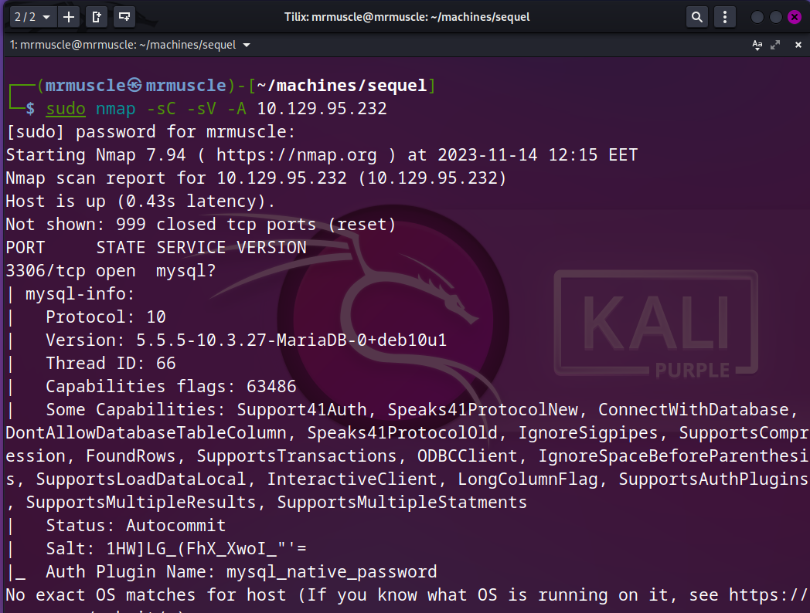
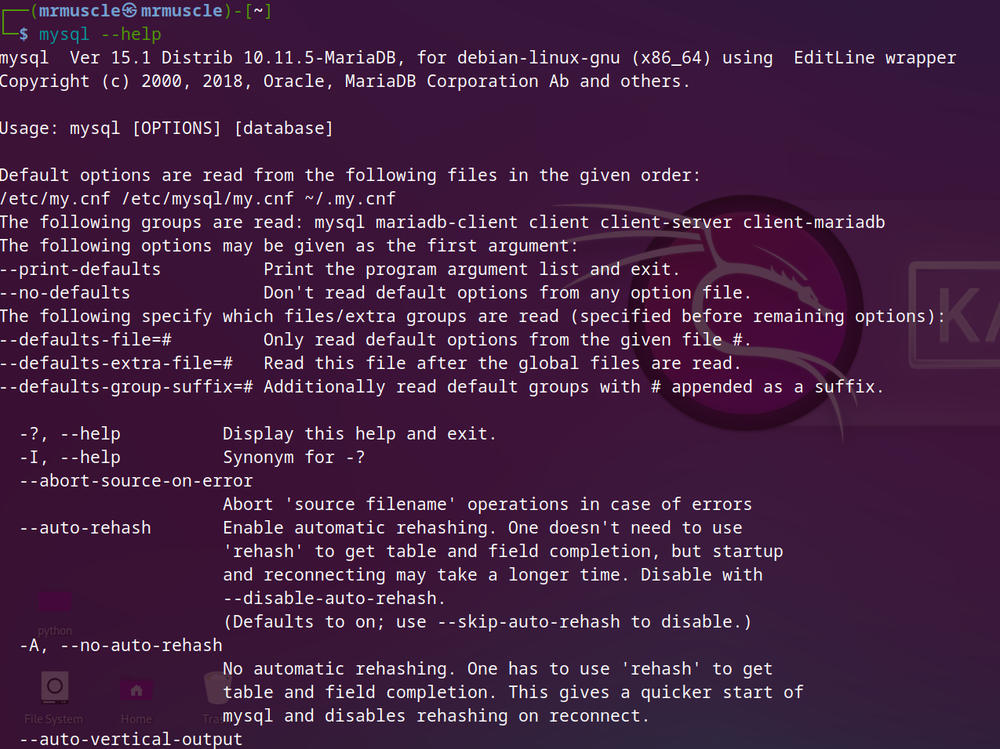
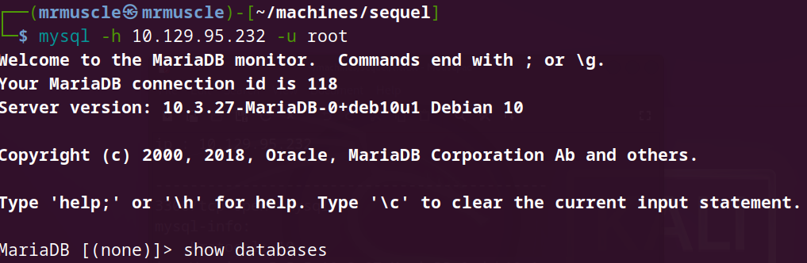
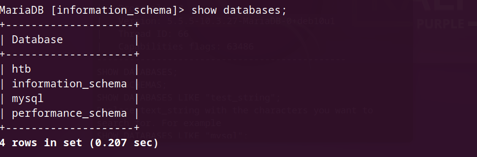
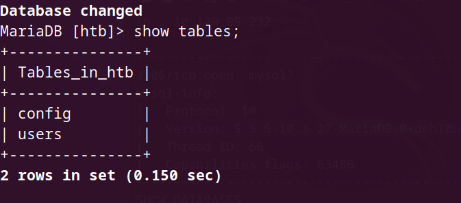
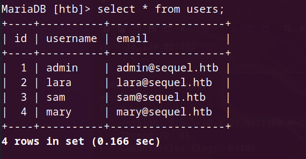
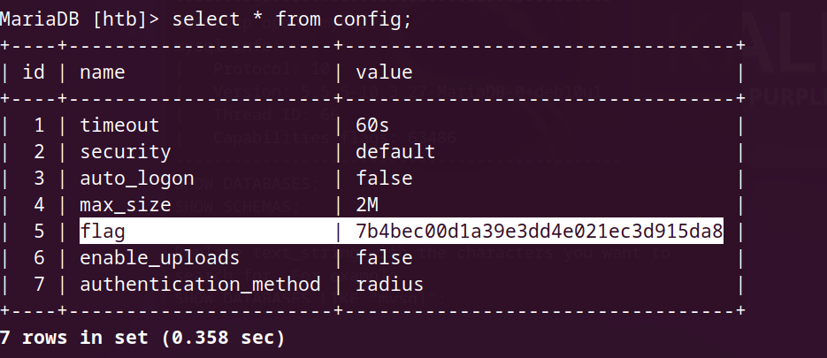

# Basic of penetration testing

***In our journy to learn penetration testing we takes a machines in HTB to can explain the basics of penetration***

## sequel machine

- after connecting with vpn you will spawn the machine  and you will have the ip address for this machine .

- as we explained in earlier machines you must know how to download vpn and connect with HTB server and ping for IP_address.
- In the next steps you will pass to the enumaration phase.

### Enumeration

- we will begin as you usualy with `nmap` tool to make a quick scan to know if there is any open ports or any vunlerable port .
- we will the next command in our terminal `sudo nmap -sC -sV -A {target_IP_addre}` .
- this command will make a quick sqan to know any open ports and know any service work on this open ports and it's versions .

  

- As you can see there is one open port which is :
  - ` 3306/tcp ` and have the `mysql service` run on it .
  - you should ask yourself what is the next step .
  - As a penetester you should know what you will attack .
  - Here we gonna deal with database which called `mysql` .

### Every machine has a basic idea to deliver to you

- the idea of this machine is making you get familier with database connections .
- And know some basic command to dealing with `mysql` database .
- So all you need to know is how to connect with `mysql` database , how you can get information from this database and then you will be able to solve this machine .

### MYSQL

- database diagram .
  
    

- I will explain mysql in three questions .

  - what is `mysql` ?
    - SQL is the standard language for dealing with Relational Databases.
    - SQL is used to insert, search, update, and delete database records "records means rows".
    - every database consist of amount of tables and every tables consist of amount of some columns and rows  as you can see in the previous image .
    - Now you should understand that you must get in every table to can fetch the data inside database and this what we will do to complete this attack . 
  - How to Use `MYSQL` ?
    - I will explain to you how to connect with database but now focus on dealing with database.
    - The following SQL statement selects all the records in the "employee" table: `SELECT * FROM employee;` .
    - `select` is an command to make action in database , `*` we type this astrisk to get all things inside the table , `employee` name of the table and you must type the semicolon after the command.
  
  - what is the `mysql` commands?
    - SELECT - extracts data from a database
    - UPDATE - updates data in a database
    - DELETE - deletes data from a database
    - INSERT INTO - inserts new data into a database
    - CREATE DATABASE - creates a new database
    - ALTER DATABASE - modifies a database
    - CREATE TABLE - creates a new table
    - ALTER TABLE - modifies a table
    - DROP TABLE - deletes a table
    - CREATE INDEX - creates an index (search key)
    - DROP INDEX - deletes an index

***Now you are know the information that makes you strong enough to deal with database***

#### Foothold

- lets begin .
- first you should download `mysql` .
- type `sudo apt update && sudo apt install mysql*` in your terminal .
- the first command you will run after installation will be help command as following.

- you can take your time in this window to know every possible information about the mysql usage.
  
- take a deep breathe and think with me , we are going to deal with database which mean that we will need to have user_name and password to get access to this database .
- then the first thing you should think about is searching about the deafult creadentials for `mysql`.

- when you searching in google you will got that the deafult user is `root` and there is no password by deafult .
  
- so we will use the next command to get in.
  

- As you can see in the previous image that we are in .
  
- Now we will try to get every possible information from the database.
  

- now we find four databases and we will get in all of them to get the flag.

- now we will type this command `USE htb;` to get in htb database .
- after get in we will type `show tables;`

- we will find that we have two rows we need to fetch them so,
- we wil fetch the users row .

- we find that we got nothing.
- so we will fetch the config row.

- and here you got the flag , and no need for fetching any tables.

- Congratulations , Assem_Ayman